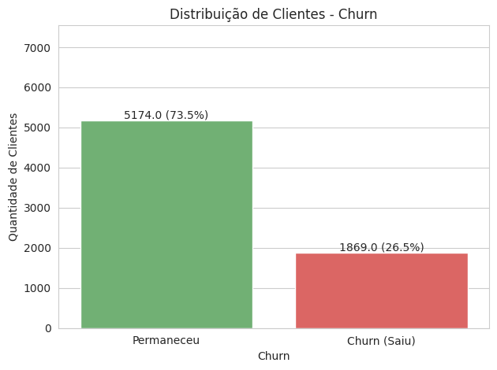
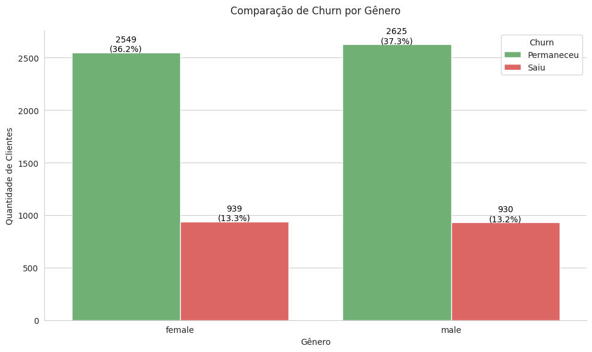
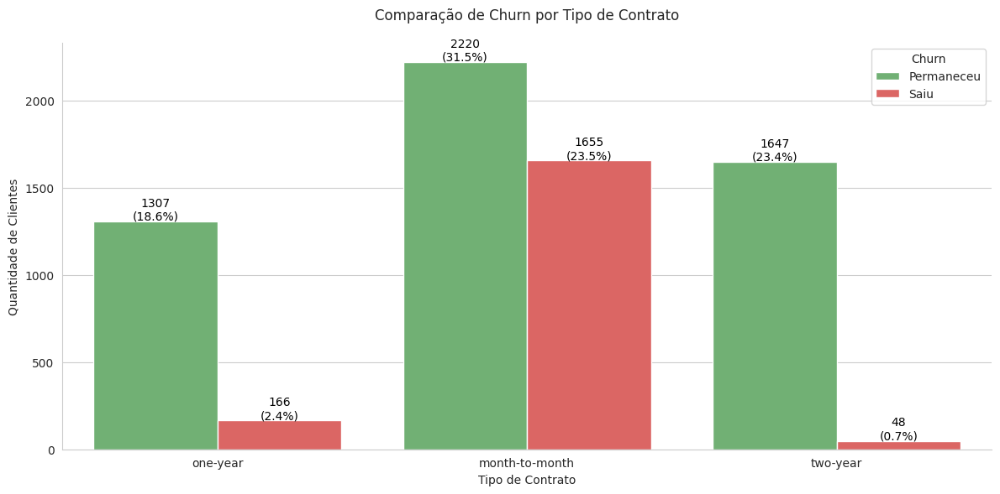
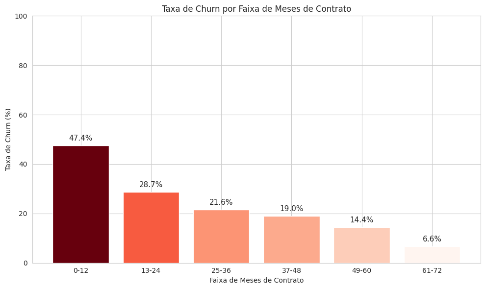
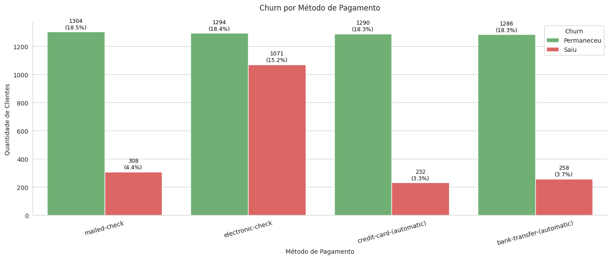
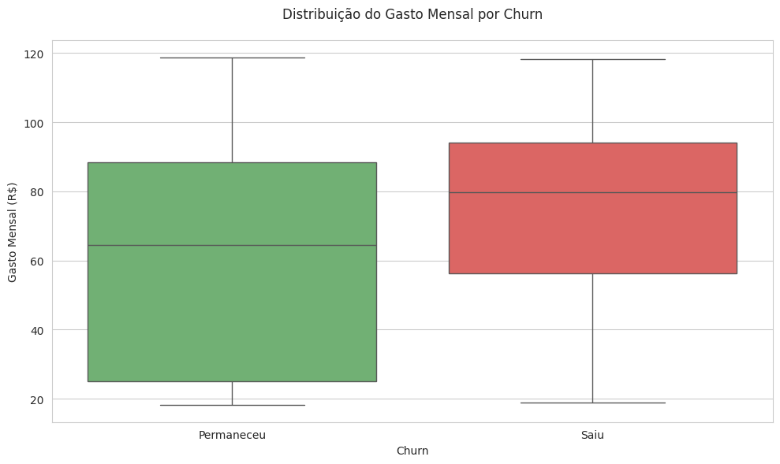
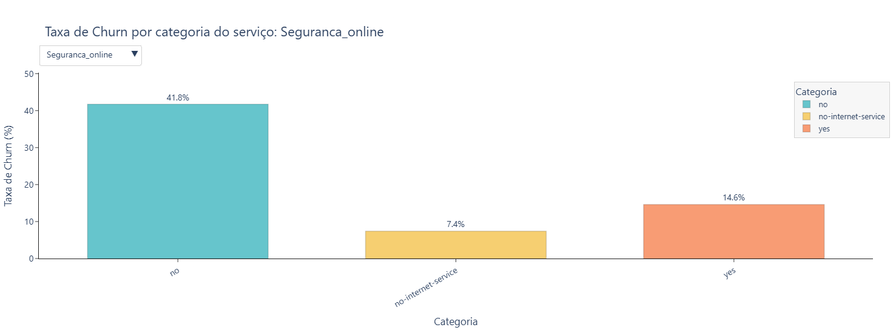

# 📊 Análise de Churn - TelecomX
Projeto proposto na formação da Oracle em Data Science. Conteudo foi passado pela Alura

## 📋 Sobre o Projeto 

Esta análise de **Churn (evasão de clientes)** da empresa **TelecomX**, provedora de serviços online e internet, tem como objetivo identificar os principais perfis e comportamentos dos clientes que estão cancelando seus serviços. A partir dessa análise, geramos **insights e recomendações práticas** para reduzir a taxa de evasão e melhorar a retenção de clientes.

### 🎯 Objetivos
- Identificar padrões de comportamento dos clientes que cancelam os serviços
- Analisar os principais fatores associados ao churn
- Fornecer recomendações estratégicas para redução da evasão
- Melhorar a retenção e fidelização de clientes

## 📊 Principais Descobertas

- **Taxa de Churn**: 26% da base de clientes
- **Fatores Críticos**: Tipo de contrato, tempo de permanência, método de pagamento
- **Serviços Chave**: Internet, Segurança Online e Suporte Técnico são fundamentais para retenção
- **Padrão de Gastos**: Clientes com maiores gastos mensais apresentam maior propensão ao churn

## 🛠️ Tecnologias Utilizadas

- **Python 3.x**
- **Pandas** - Manipulação e análise de dados
- **NumPy** - Operações numéricas
- **Matplotlib/Seaborn** - Visualização de dados
- **Plotly** - Gráficos interativos

## 📋 Pré-requisitos

Antes de executar o projeto, certifique-se de ter o Python instalado em sua máquina. Recomendamos a versão 3.8 ou superior.

### Verificar instalação do Python:
```bash
python --version
# ou
python3 --version
```

## ⚙️ Instalação

### 1. Clone o repositório
```bash
git clone gh repo clone lpxprajed/projeto-telecomX
cd projeto-telecomX
```

### 2. Crie um ambiente virtual (recomendado)
```bash
# Windows
python -m venv venv
venv\Scripts\activate

# macOS/Linux
python3 -m venv venv
source venv/bin/activate
```

### 3. Instale as dependências
```bash
pip install -r requirements.txt
```

### 4. Arquivo requirements.txt
`requirements.txt` com as seguintes dependências:
```
pandas>=1.5.0
numpy>=1.21.0
matplotlib>=3.5.0
seaborn>=0.11.0
plotly>=5.0.0
jupyter>=1.0.0
requests>=2.28.0
```

## 🚀 Como Executar

### 1. Executar análise completa
```bash
python main.py
```

### 2. Executar via Jupyter Notebook
```bash
jupyter notebook
# Abra o arquivo: analise_churn_telecomx.ipynb
```


## 🔄 Processo ETL

### Extração
- Dados obtidos via API da TelecomX (formato JSON)
- Normalização para estrutura tabular

### Transformação
- Remoção de prefixos desnecessários
- Eliminação de valores nulos e duplicatas
- Correção de tipos de dados
- Padronização de textos (minúsculas, sem espaços extras)
- Conversão de valores booleanos ("Yes"/"No" → 0/1)
- Tradução de colunas (inglês → português)
- Criação da coluna `Contas_Diarias` (gasto_mensal / 30)

### Carga
- Dados limpos salvos em formato CSV
- Backup dos dados originais mantido

## 📈 Principais Análises

### 1. **Distribuição Geral do Churn**
- 74% clientes ativos vs 26% churn
- Base de mais de 7.000 clientes


### 2. **Análise por Gênero**
- Sem diferença significativa entre homens e mulheres


### 3. **Tipo de Contrato**
- Contratos mensais: maior taxa de churn
- Contratos longos: maior retenção


### 4. **Tempo de Permanência**
- Primeiros 12 meses: período crítico
- Churn diminui com o tempo de permanência


### 5. **Método de Pagamento**
- Boleto online: maior taxa de churn (+10%)
- Débito/cartão: menor propensão ao cancelamento


### 6. **Gastos Mensais**
- Clientes com maiores gastos: maior churn
- Mediana churn: ~$80 vs retenção: ~$65


### 7. **Serviços Contratados**
- Internet, Segurança Online e Suporte Técnico são cruciais
- Ausência desses serviços aumenta o churn


## 💡 Recomendações Implementadas

1. **Períodos de Teste Gratuito**
   - Para Internet, Segurança Online e Suporte Técnico

2. **Planos Exclusivos Multi-Serviços**
   - Descontos para contratação de múltiplos serviços

3. **Incentivo a Contratos Longos**
   - Benefícios exclusivos para contratos anuais/bianuais

4. **Otimização de Meios de Pagamento**
   - Incentivos para cartão de crédito e débito automático

## 👥 Autor

- **Miguel Lopes** - *Análise de Churn TelecomX*

## 📞 Contato

- **Email**: miguellopes008@gmail.com
- **LinkedIn**: [Miguel Lopes](https://www.linkedin.com/in/miguel-lopes-ab8a97268/)